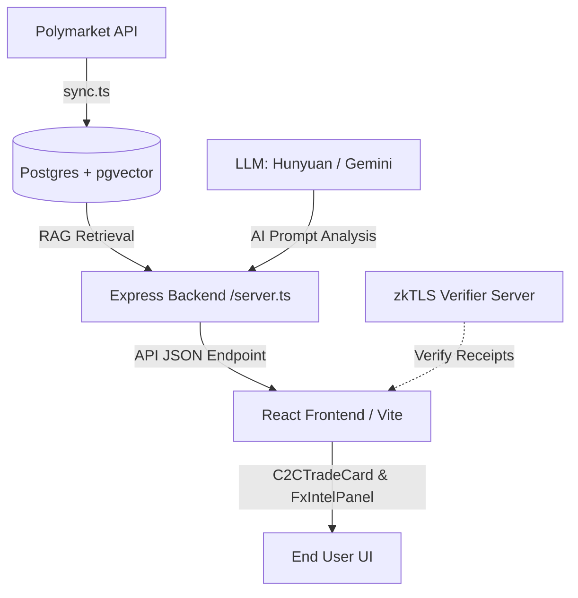

# FX Intel C2C: 基于预测市场与 zkTLS 的智能外汇交易门户 (AI-Driven FX C2C Gateway)

FX Intel C2C 是一款面向 Web3 和 AI 比赛设计的新一代智能外汇 P2P/C2C 交易平台。项目将实时预测市场数据（Polymarket API）与大语言模型（LLM）决策深度融合，并结合了 zkTLS 证明技术，为用户提供科学、可信且智能的外汇换汇交易决策辅助。

---

## 🌟 核心特性 (Key Features)

* **🔮 实时预测市场同步 (Real-time Prediction Market Integration)**
  使用 Polymarket 官方 API (Gamma API) 实时拉取影响汇率波动的宏观预测事件（例如美联储降息概率、加税政策概率、美国衰退概率等）。
* **🧠 多模型 AI 决策系统 (Multi-LLM Decision Engine)**
  内置双语决策提示词架构，原生支持 **腾讯混元大模型 (Tencent Hunyuan `hy3-preview`)** 和 **Google Gemini** 快速热切换，自动生成汇率波动置信度评分与精细的交易策略。
* **🛡️ 可信数据证明 (zkTLS Data Verification)**
  支持本地启动虚拟可信数据证明（Mock 演示模式，免安装插件一键体验），同时可无缝联动本地真实的 `tlsn-extension` 与 `tlsn-verifier-server`，验证数据源的真实性与隐私性，确保 C2C 交易的凭证防篡改。
* **📂 向量检索增强 (RAG & Vector Search)**
  利用 PostgreSQL + `pgvector` 存储预测事件，基于 RAG 技术在用户进行外汇换汇时自动检索并展现与其交易币种最相关的宏观市场因子及胜率趋势。
* **💎 奢华毛玻璃视觉交互 (Premium Glassmorphism UI)**
  基于 React 19 + TypeScript + Vite 构建，适配亮色与暗色模式的渐变流光视觉体系。在极速换汇卡片中包含基于 React Portal 传送门实现的高端可交互决策 Modal。

---

## 🏗️ 架构与数据流 (Architecture & Data Flow)



---

## 🛠️ 技术栈 (Tech Stack)

* **前端**: React 19, TypeScript, Vite, CSS (原生现代样式体系，支持 CSS 变量与微动画), Lucide React (图标)
* **后端**: Express.js, TypeScript, `tsx` 运行时
* **数据库**: PostgreSQL, `pgvector` 扩展
* **大模型驱动**: Tencent Hunyuan API (`hy3-preview`), Google Generative AI (Gemini)

---

## 🚀 快速启动 (Getting Started)

### 1. 环境准备
确保您的系统中已安装 Node.js、npm 和 PostgreSQL（需启用 `pgvector` 扩展）。

在 `./fx-intel-c2c` 目录下创建并配置 `.env` 环境变量文件：

```env
# 端口配置
PORT=3001

# 数据库配置
DB_USER=postgres
DB_HOST=localhost
DB_DATABASE=fx_intel_c2c
DB_PASSWORD=您的数据库密码
DB_PORT=5432

# AI 提供商配置 (gemini 或 hunyuan)
LLM_PROVIDER=hunyuan
PROMPT_LANG=zh

# 腾讯混元大模型配置
HUNYUAN_API_KEY=您的混元API_KEY
HUNYUAN_MODEL=hy3-preview

# Gemini 配置
GEMINI_API_KEY=您的Gemini_API_KEY
GEMINI_MODEL=gemini-1.5-flash
```

### 2. 数据库初始化与数据同步
首先，通过以下脚本连接数据库并同步 Polymarket 预测事件：

```bash
# 安装依赖
npm install

# 运行 Polymarket 数据同步 Worker
npm run sync
```

### 3. 启动开发服务

```bash
# 启动 API 后端服务 (监听 3001 端口)
npm run server

# 启动 Vite 前端开发服务器 (默认监听 5173 端口)
npm run dev
```

打开浏览器访问 `http://localhost:5173/` 即可体验平台。

### 4. 体验可信数据证明 (zkTLS Proof Experience)
* **🔮 Mock 演示模式 (免插件一键体验)**：在极速换汇卡片的 **“第二步：生成付款的密码学证明 (zkTLS)”** 中，直接点击底部的 **“Mock 演示”** 按钮。系统会全自动模拟与瑞士网银建立加密 TLS 连接、脱敏隐私字段、并生成/验证 zkTLS 证明的流畅动画，非常适合路演和功能演示。
* **🛠️ 真实插件联动 (Full Protocol Integration)**：
  1. 确保已在本地运行 `tlsn-verifier-server` (在 `tlsn-extension/servers` 下运行 `cargo run -p tlsn-verifier-server`)。
  2. 在 Chrome 中加载并配置好 `tlsn-extension` 浏览器插件。
  3. 在极速换汇卡片中点击 **“Verify with zkTLS”**，即可唤起真实浏览器插件连接瑞士网银生成真实的零知识证明凭证。

---

## 📂 项目结构 (Project Structure)

```text
fx-intel-c2c/
├── src/
│   ├── components/
│   │   ├── C2CTradeCard.tsx   # C2C 极速换汇交易卡片与决策 Portal 弹窗
│   │   └── FxIntelPanel.tsx   # FX Intel 智能宏观决策看板
│   ├── App.tsx                # 主页面装配与亮暗主题管理
│   ├── server.ts              # API 后端与多 LLM RAG 决策分流服务
│   ├── sync.ts                # Polymarket 预测数据同步器
│   └── index.css              # 全局现代设计系统与主题配置
├── .env                       # 环境变量配方（已在 .gitignore 中忽略）
├── vite.config.ts
└── package.json
```
