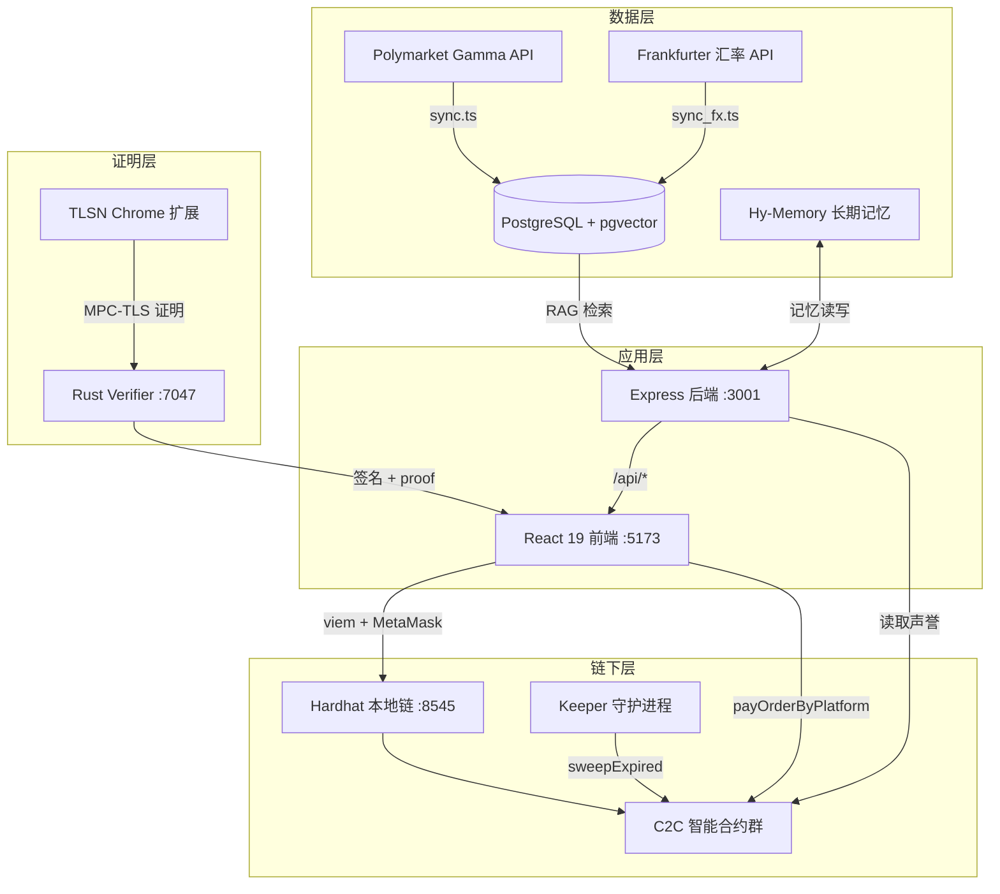

# FX Intel C2C

**基于预测市场、大模型决策与 zkTLS 零知识证明的去中心化 C2C 外汇换汇平台**

> ETH Beijing 2026 黑客松终稿 · AI × Web3 × zkTLS

---

## 目录

- [项目概述](#项目概述)
- [核心创新点](#核心创新点)
- [系统架构](#系统架构)
- [技术栈](#技术栈)
- [功能模块详解](#功能模块详解)
  - [FX Intel AI 决策引擎](#1-fx-intel-ai-决策引擎)
  - [C2C 链上交易与托管](#2-c2c-链上交易与托管)
  - [zkTLS 支付证明与清算](#3-zktls-支付证明与清算)
  - [四角色前端面板](#4-四角色前端面板)
  - [Keeper 链下守护进程](#5-keeper-链下守护进程)
- [智能合约体系](#智能合约体系)
- [后端 API 接口](#后端-api-接口)
- [Rust Verifier 服务](#rust-verifier-服务)
- [数据库设计](#数据库设计)
- [合约地址与部署](#合约地址与部署)
- [环境变量配置](#环境变量配置)
- [快速启动（完整 Demo）](#快速启动完整-demo)
- [公网 Demo（ngrok）](#公网-demonngrok)
- [zkTLS 浏览器扩展安装](#zktls-浏览器扩展安装)
- [测试账户](#测试账户)
- [项目目录结构](#项目目录结构)
- [测试与质量保障](#测试与质量保障)
- [黑客松交付清单](#黑客松交付清单)
- [免责声明](#免责声明)

---

## 项目概述

**FX Intel C2C** 是一款将 **宏观预测市场数据**、**大语言模型（LLM）换汇决策** 与 **zkTLS 零知识 Web 证明链上清算** 深度融合的去中心化 C2C 外汇换汇平台。

传统 C2C 换汇依赖中心化平台做支付凭证审核，存在信任成本高、审核不透明、跨境合规难等问题。本项目通过以下三条链路解决：

1. **FX Intel**：从 Polymarket 拉取影响汇率的宏观事件，结合 30 天真实历史汇率与 pgvector RAG，由 LLM 生成换汇时机分析与置信度评分。
2. **C2C 智能合约**：V4 版链上托管体系（Bond + Penalty + Reputation），支持 CRYPTO / FIAT 双向交易、声誉-保证金联动、公开 Sweep 清理。
3. **zkTLS 清算**：用户通过 TLSNotary 浏览器扩展生成 Wise / 支付宝等支付平台的零知识 Web 证明，Rust Verifier 验签后，智能合约链上核验并完成资金结算。

**一句话定位**：AI 告诉你「什么时候换」；zkTLS 证明「钱确实转了」；智能合约负责「链上托管与结算」。

---

## 核心创新点

| 维度 | 创新内容 |
|------|----------|
| **AI × 预测市场** | Polymarket Gamma API 实时同步 + pgvector 语义检索 + 腾讯混元大模型决策，生成中英文换汇策略 |
| **zkTLS 链上清算** | TLSNotary 证明直接在链上被智能合约核验，无需信任中心化审核方 |
| **声誉-保证金联动（V4）** | 超时次数影响 riskLevel → requiredBondBps 动态调整，渐进式经济惩罚 |
| **可插拔支付验证器** | Wise / Alipay 平台验证器独立部署，通过 TLSNVerifier 注册表接入，无需升级核心合约 |
| **汇率快照保护** | 下单时锁定 rateVersion，防止商家改价攻击 |
| **公开 Sweep 机制** | 任何 EOA 可调用 `sweepExpired` 清理过期订单，配合 Keeper 自动化运维 |
| **长期记忆增强** | 集成 Hy-Memory 长期记忆服务，AI 决策参考用户历史偏好与交易习惯 |
| **链上声誉融合** | FX Intel 分析时读取 C2CRiskManager 链上声誉数据，影响保证金建议 |

---

## 系统架构



### 端到端交易流程（CRYPTO 方向）

```
用户查看 FX Intel AI 分析
    ↓
选择承兑商 + 输入金额 → 链上下单 placeOrder（USDT 托管 + 保证金锁定）
    ↓
15 分钟倒计时内，通过 Wise/支付宝完成法币转账
    ↓
TLSN 扩展生成 zkTLS 证明 → Rust Verifier 验签
    ↓
用户提交 proof → 链上 payOrderByPlatform → 订单 COMPLETED
    ↓
买家 claim 保证金，商家收到 crypto
```

---

## 技术栈

| 层级 | 技术 |
|------|------|
| **前端** | React 19, TypeScript, Vite 8, viem 2.x, Lucide React, 原生 CSS（Glassmorphism + CSS Variables + 亮暗主题） |
| **后端** | Express.js, TypeScript, tsx 运行时, node-postgres |
| **数据库** | PostgreSQL + pgvector 扩展 |
| **AI / LLM** | 腾讯混元 (`hy3-preview`) |
| **智能合约** | Solidity 0.8.28 (EVM: cancun), Hardhat 3, OpenZeppelin 5.x, viem |
| **证明验证** | TLSNotary v0.1.0-alpha.14, Rust + axum + tokio + SQLite |
| **链下运维** | Keeper (TypeScript + viem), 事件监听 + 定时 Sweep |
| **外部 API** | Polymarket Gamma API, Frankfurter 汇率 API, Hy-Memory |

---

## 功能模块详解

### 1. FX Intel AI 决策引擎

**文件**：`src/components/FxIntelPanel.tsx`, `src/server.ts`, `src/sync.ts`, `src/sync_fx.ts`

| 功能 | 说明 |
|------|------|
| **Polymarket 宏观事件同步** | `sync.ts` 从 Gamma API 分页拉取开放事件，白名单过滤（Fed/关税/衰退/CNY/GDP 等宏观词），黑名单排除体育/娱乐/地方选举等噪音 |
| **pgvector RAG 检索** | 768 维 embedding（本地 hash 确定性向量），按 `<=>` 余弦距离检索与交易币种对最相关的 Top-N 事件 |
| **多市场盘口** | 支持 Polymarket 多选项事件，悬停实时拉取各子市场胜率 |
| **30 天真实历史汇率** | Frankfurter API 拉取 USD/CNY、USD/MYR、CNY/MYR，存入 `fx_history` 表，前端 SVG 折线图展示 |
| **波动率分析** | 计算 7d/30d 涨跌幅、30 天实现波动率、当前汇率在历史区间中的分位数 |
| **混元 LLM 决策** | 腾讯混元 `hy3-preview`，中英文 Prompt 分流，输出置信度、策略建议、风险提示 |
| **链上声誉融合** | 读取 C2CRiskManager 的 completedCount / timeoutCount / riskLevel / requiredBondBps |
| **长期记忆** | Hy-Memory 检索用户历史偏好，交易完成后自动保存记忆 |
| **AI 智能体自动巡检** | 可配置定时自动重新分析（默认 9000 分钟），浮动助手 Bot 主动推送建议 |
| **有效汇率计算** | 基础点差 0.3% + 金额滑点模拟，输出 Platform Effective Rate |

### 2. C2C 链上交易与托管

**文件**：`contracts/contracts/*.sol`, `src/components/C2CTradeCard.tsx`

| 功能 | 说明 |
|------|------|
| **CRYPTO 订单** | 买家用 USDT 换法币：下单 → 法币转账 → 提交 zkTLS 证明 → 完成 |
| **FIAT 订单** | 商家用法币买 crypto：下单 → 商家收款证明 → 完成 |
| **保证金机制（V4）** | BondVault 锁定 bondAmount，完成后 claim 回；超时则惩罚性分配 |
| **声誉系统** | 连续超时 → riskLevel 上升 → requiredBondBps 增加；15 次累计超时 → 临时冻结 |
| **汇率快照** | placeOrder 时锁定 rateVersion，proof 必须匹配绑定 hash |
| **营业时间** | 商家可设 businessHours + openNow/closeNow 手动覆盖 |
| **单笔限额** | 管理员设置 maxOrderAmount（USD 等值） |
| **紧急暂停** | Admin 可 pause/unpause 整个 Escrow 合约 |
| **订单倒计时** | 15 分钟 deadline，前端基于链上 deadline 实时倒计时 |
| **承兑商筛选** | 按 quote 法币动态过滤匹配的 Wise/Alipay 渠道 |

### 3. zkTLS 支付证明与清算

**文件**：`verifier/`, `public/plugins/wise.js`, `public/plugins/alipay.js`, `public/plugins/swissbank.js`

| 功能 | 说明 |
|------|------|
| **TLSN Chrome 扩展** | 用户安装扩展后，访问 Wise/支付宝页面生成 MPC-TLS 零知识证明 |
| **Rust Verifier Server** | 端口 7047，WebSocket MPC-TLS 会话 + HTTP proof 签名 + SQLite 存证 |
| **证明插件** | `wise.js`（Contacts + Transfer 双 proof）、`alipay.js`（支付详情 proof）、`swissbank.js`（演示用） |
| **Order Binding Hash** | 证明与特定订单（orderId + rateVersion + 商家/买家身份 hash）密码学绑定，防重放 |
| **链上验证** | TLSNVerifier → verifyAndDelegate → PlatformVerifier（Wise/Alipay）→ Escrow 结算 |
| **KYB 商家注册** | 商家可通过 zkTLS KYB 证明自助注册（C2CAdmin.registerMerchantWithKYB） |
| **扩展检测** | 前端每秒检测 `window.tlsn`，未安装时显示下载引导 |

### 4. 四角色前端面板

**文件**：`src/App.tsx` + 四个 Panel 组件

| Tab | 组件 | 功能 |
|-----|------|------|
| **Swap & AI 分析** | `FxIntelPanel` + `C2CTradeCard` | AI 决策看板 + 极速换汇卡片 + zkTLS 清算流程 |
| **个人控制面板** | `DashboardPanel` | 钱包余额、链上声誉、活跃订单、身份绑定、证明提交、保证金 claim |
| **承兑商终端** | `MerchantPanel` | 产品上下架、汇率发布、营业时间、collateral 管理、FIAT 收款证明、入驻申请 |
| **管理控制台** | `AdminPanel` | 资产管理、商家审核、承兑商入驻审批、黑名单/冻结、系统参数 |

**全局 UI 特性**：
- 中英文双语切换
- 亮/暗主题（跟随系统 `prefers-color-scheme`）
- 系统状态栏：TLSN 扩展 / PostgreSQL / Rust Verifier 健康检测
- Toast 非阻塞通知
- 响应式布局（900px 以下单列）

### 5. Keeper 链下守护进程

**文件**：`keeper/src/`

| 功能 | 说明 |
|------|------|
| **事件监听** | WebSocket 订阅 Escrow 合约 OrderStatusChanged 事件 |
| **过期调度** | 维护 merchant × product × assetType 过期队列 |
| **自动 Sweep** | 定时调用 `sweepExpired` / `sweepExpiredBatch` 清理过期订单 |
| **状态持久化** | JSON 文件原子写入（lastProcessedBlock + schedule） |
| **Replay 补扫** | 启动时 replay 遗漏区块，防止重启丢事件 |
| **Health 端点** | `:9091/health` 暴露 keeper 余额、最后 tick 时间、队列大小 |
| **部署文件驱动** | 从 `contracts/deployments/demo-31337.json` 自动发现 Escrow 地址 |

---

## 智能合约体系

> 详细文档见 [`contracts/CONTRACT_STRUCTURE.md`](contracts/CONTRACT_STRUCTURE.md)

### 合约清单

| 合约 | 职责 |
|------|------|
| **C2CAdmin** | 平台配置中心：资产列表、商家注册/KYB、汇率发布、营业时间、单笔限额 |
| **C2CEscrow** | 核心托管：产品上架、订单生命周期、资金流转、Sweep 清理 |
| **C2CBondVault** | 保证金托管/结算/claim（Pull-model） |
| **C2CRiskManager** | 声誉评分、riskLevel、requiredBondBps、黑名单/冻结 |
| **TLSNVerifier** | TLSN 证明完整性验证、平台验证器注册表、KYB 验证 |
| **WisePlatformVerifier** | Wise 转账证明解析（transferId、金额、货币、时间窗口） |
| **AlipayPlatformVerifier** | 支付宝支付证明解析（orderId、金额、状态、gmtSuccess） |

### 部署拓扑

```
Admin (部署者)
  ├── TLSNVerifier (核心验证)
  ├── C2CAdmin (平台配置)
  ├── C2CRiskManager (声誉引擎)
  │     ↕ 三角绑定
  ├── C2CEscrow (订单 + 资金)
  │     └── C2CBondVault (保证金)
  └── Platform Verifiers
        ├── WisePlatformVerifier
        └── AlipayPlatformVerifier
```

### 订单状态机

```
PENDING ──(proof 成功)──→ COMPLETED
   │
   └──(超时)──→ EXPIRED ──(sweep/cleanup)──→ 删除

WAITING (FIAT) ──(商家 proof)──→ COMPLETED
   │
   └──(超时)──→ EXPIRED
```

### V4 保证金与惩罚

- CRYPTO 买家超时 → 保证金转给商家
- FIAT 商家超时 → 买家 claim 本金 + 保证金；商家 stake 被扣
- 连续超时 3 次 → riskLevel 上升
- 累计超时 15 次 → temporarilyFrozen = true
- 90 天衰减 → requiredBondBps 逐步恢复

---

## 后端 API 接口

**服务**：Express @ `:3001`（开发时通过 Vite 代理 `/api/*`）

| 方法 | 路径 | 说明 |
|------|------|------|
| `GET` | `/api/health` | 健康检查，返回 LLM provider 和 model |
| `GET` | `/api/fx-intel` | **核心分析接口**。参数：`base`, `quote`, `amount`, `horizon`, `lang`, `userAddress` |
| `POST` | `/api/refresh-fx-history` | 强制从 Frankfurter 刷新历史汇率并存库 |
| `POST` | `/api/save-memory` | 保存用户长期记忆到 Hy-Memory |
| `POST` | `/api/acceptors/apply` | 承兑商申请入驻 |
| `GET` | `/api/acceptors/status?address=` | 查询承兑商审核状态 |
| `GET` | `/api/acceptors` | 管理员获取所有承兑商申请 |
| `POST` | `/api/acceptors/approve` | 管理员审批承兑商 |
| `POST` | `/v1/embeddings` | OpenAI 兼容 Embedding 代理（供 Hy-Memory 使用） |

### `/api/fx-intel` 响应结构

```json
{
  "currentRate": 7.285,
  "effectiveRate": 7.263,
  "change7d": 0.12,
  "change30d": -0.45,
  "realizedVol30d": 1.23,
  "percentile30d": 65,
  "history": [{ "date": "2026-05-08", "rate": 7.21 }, "..."],
  "ragEvents": [{ "title": "...", "odds": 0.72, "slug": "..." }],
  "memories": ["..."],
  "onChainRep": { "riskLevel": 0, "requiredBondBps": 1000, "..." },
  "analysis": {
    "confidence": 72,
    "recommendation": "wait",
    "summary": "...",
    "risks": ["..."],
    "strategy": "..."
  }
}
```

---

## Rust Verifier 服务

**目录**：`verifier/` · 端口 `:7047`

| 端点 | 说明 |
|------|------|
| `GET /health` | 健康检查 |
| `GET /info` | 服务元信息 |
| `POST /session` | 创建 MPC-TLS 验证会话 |
| `WS /verifier?sessionId=` | WebSocket MPC-TLS 验证通道 |
| `WS /proxy?token=` | TLS 代理通道（扩展使用） |
| `POST /proof` | 提交并签名 proof |
| `GET /proof/:sessionId` | 查询 proof 记录 |
| `PATCH /proof/:sessionId/tx` | 关联链上 txHash |

**关键环境变量**（`verifier/.env`）：

```env
VERIFIER_PRIVATE_KEY=0x...        # 验证者签名私钥（Hardhat account[9]）
CHAIN_ID=31337
PROOF_API_KEYS=admin-demo-key:*
SIWE_JWT_SECRET=...
SIWE_DOMAIN=your-ngrok-domain.ngrok-free.dev
```

**构建与运行**：

```bash
cd verifier && cargo build --release
# 或
npm run verifier
```

---

## 数据库设计

**引擎**：PostgreSQL + pgvector

| 表 | 字段 | 说明 |
|----|------|------|
| `polymarket_events` | id, title, odds, url, slug, embedding(768), multi_markets(JSONB), updated_at | Polymarket 预测事件 + 向量 |
| `fx_history` | pair(PK), history_data(JSONB), updated_at | 30 天历史汇率（Frankfurter） |
| `acceptors` | address(PK), status, created_at, updated_at | 承兑商入驻申请 |

初始化：`src/db.ts` 的 `initDatabase()` 在 server 启动时自动建表。

---

## 合约地址与部署

### 当前网络：Hardhat 本地链

| 项 | 值 |
|----|-----|
| Chain ID | `31337` |
| RPC（本地） | `http://localhost:8545` |
| RPC（公网，经 Vite 代理） | `https://<ngrok-domain>/rpc` |

### Demo 部署（当前生效）

> 文件：`contracts/deployments/demo-31337.json` · 部署时间：2026-06-06

| 合约 | 地址 |
|------|------|
| C2CAdmin | `0xdc64a140aa3e981100a9beca4e685f962f0cf6c9` |
| C2CEscrow | `0x5fc8d32690cc91d4c39d9d3abcbd16989f875707` |
| C2CBondVault | `0x0165878a594ca255338adfa4d48449f69242eb8f` |
| C2CRiskManager | `0xa513e6e4b8f2a923d98304ec87f64353c4d5c853` |
| TLSNVerifier | `0xcf7ed3acca5a467e9e704c703e8d87f634fb0fc9` |
| WisePlatformVerifier | `0x9a9f2ccfde556a7e9ff0848998aa4a0cfd8863ae` |
| AlipayPlatformVerifier | `0x68b1d87f95878fe05b998f19b66f4baba5de1aed` |

| Token | 地址 |
|-------|------|
| USDT | `0x5fbdb2315678afecb367f032d93f642f64180aa3` |
| USDC | `0xe7f1725e7734ce288f8367e1bb143e90bb3f0512` |
| DAI | `0x9fe46736679d2d9a65f0992f2272de9f3c7fa6e0` |

### Web 部署（备用）

> 文件：`contracts/deployments/web-31337.json`

| 合约 | 地址 |
|------|------|
| C2CEscrow | `0x7969c5ed335650692bc04293b07f5bf2e7a673c0` |
| C2CAdmin | `0x2bdcc0de6be1f7d2ee689a0342d76f52e8efaba3` |

### 部署脚本

```bash
cd contracts
npm run node          # 启动 Hardhat 节点
npm run deploy:demo   # Demo 部署（3 商家 × 产品初始化 + 写 .env）
npm run deploy:web    # Web 部署
npm run deploy:local  # 本地最小部署
npm run test          # 运行全部 324 个测试
```

---

## 环境变量配置

在项目根目录创建 `.env` 文件：

```env
# ── 服务端口 ──
PORT=3001

# ── 数据库 ──
DATABASE_URL=postgresql://user@localhost:5432/postgres

# ── AI 提供商（腾讯混元）──
LLM_PROVIDER=hunyuan
PROMPT_LANG=zh

HUNYUAN_API_KEY=sk-...
HUNYUAN_MODEL=hy3-preview
HUNYUAN_BASE_URL=https://tokenhub.tencentmaas.com/v1

# ── 智能合约地址（deploy:demo 自动写入）──
VITE_CHAIN_ID=31337
VITE_RPC_URL=http://127.0.0.1:8545
VITE_C2C_ADMIN_ADDRESS=0x...
VITE_C2C_ESCROW_ADDRESS=0x...
VITE_C2C_BOND_VAULT_ADDRESS=0x...
VITE_C2C_RISK_MANAGER_ADDRESS=0x...
VITE_USDT_ADDRESS=0x...
VITE_MERCHANT_ADDRESS=0x...
VITE_VERIFIER_SIGNER_ADDRESS=0xa0Ee7A142d267C1f36714E4a8F75612F20a79720
VITE_VERIFIER_HOST=localhost:7047
VITE_SSL=false
```

> **注意**：前端 API 请求统一使用相对路径 `/api/...`，由 Vite 开发服务器代理到 `:3001`，无需配置 `VITE_API_URL`。

---

## 快速启动（完整 Demo）

### 前置依赖

- Node.js ≥ 18
- PostgreSQL（启用 pgvector 扩展）
- Rust + Cargo（Verifier 编译）
- Chrome 浏览器（TLSN 扩展）

### 1. 安装依赖

```bash
cd fx-intel-c2c
npm install
cd contracts && npm install && cd ..
cd keeper && npm install && cd ..
```

### 2. 配置环境变量

复制上方 [环境变量配置](#环境变量配置) 模板，填入 API Key 和数据库连接。

### 3. 初始化数据

```bash
# 同步 Polymarket 预测事件到 pgvector
npm run sync

# 同步 30 天历史汇率
npm run sync-fx
```

### 4. 启动全部服务（6 个终端）

```bash
# Terminal 1 — 本地区块链
npm run chain

# Terminal 2 — 部署合约（首次或重启链后）
npm run chain:deploy

# Terminal 3 — Express 后端
npm run server

# Terminal 4 — Vite 前端
npm run dev

# Terminal 5 — Rust Verifier
npm run verifier

# Terminal 6 — Keeper 守护进程
npm run keeper
```

### 5. 安装 TLSN 扩展

见下方 [zkTLS 浏览器扩展安装](#zktls-浏览器扩展安装)。

### 6. 访问

打开 `http://localhost:5173/`，连接 MetaMask 到 Chain ID `31337`。

---

## 公网 Demo（ngrok）

通过 ngrok 将前端暴露到公网，Vite 代理自动转发 API / RPC / Verifier 请求。

### ngrok 配置

`ngrok.yml`：

```yaml
version: "3"
tunnels:
  frontend:
    proto: http
    addr: 5173
    domain: your-domain.ngrok-free.dev
```

### 启动

```bash
ngrok start --config ngrok.yml frontend
```

### MetaMask 自定义网络

| 字段 | 值 |
|------|-----|
| Network Name | Hardhat Local (ngrok) |
| RPC URL | `https://your-domain.ngrok-free.dev/rpc` |
| Chain ID | `31337` |
| Currency Symbol | ETH |

### Vite 代理路由

| 前端路径 | 代理目标 |
|----------|----------|
| `/api/*` | `localhost:3001` |
| `/rpc` | `localhost:8545` |
| `/session`, `/verifier`, `/proof`, `/proxy`, `/info` | `localhost:7047` |

---

## zkTLS 浏览器扩展安装

1. **下载**：访问前端页面，点击「📥 下载 zkTLS 扩展包 (ZIP)」（`/zkTLS-extension.zip`）
2. **解压**：将 zip 解压到独立文件夹
3. **打开 Chrome 扩展页**：访问 `chrome://extensions/`
4. **启用开发者模式**：右上角开关
5. **加载已解压的扩展程序**：选择解压后的文件夹
6. **重新检测**：回到前端页面，点击「重新检测」或刷新页面

安装成功后，页面顶部状态栏显示「TLSN 扩展: 已加载 (Active)」。

---

## 测试账户

Hardhat 确定性账户（`deploy-c2c-demo.ts` 初始化）：

| 角色 | 地址 | 索引 |
|------|------|------|
| Admin（部署者） | `0xf39Fd6e51aad88F6F4ce6aB8827279cffFb92266` | [0] |
| Merchant 1 | `0x70997970C51812dc3A010C7d01b50e0d17dc79C8` | [1] |
| Merchant 2 | `0x3C44CdDdB6a900fa2b585dd299E03d12FA4293BC` | [2] |
| Merchant 3 | `0x90F79bf6EB2c4f870365E785982E1f101E93b906` | [3] |
| User 1 | `0x15d34AaF54267DB7D7c367839AAf71a00a2c6a65` | [4] |
| User 2 | `0x9965507D1a55bcC2695c58ba16Fb37d819B0a4dc` | [5] |
| User 3 | `0x976EA74026E726554bD657FA54763abd0C3a0aa9` | [6] |
| User 4 | `0x14dC79964da2C08b23698B3D3cc7Ca32193d9955` | [7] |
| User 5 | `0x23618e81E3f5cdF9f54C3d65f7FBc0aBF5B21E8f` | [8] |
| Verifier Signer | `0xa0Ee7A142d267C1f36714E4a8F75612F20a79720` | [9] |

> Demo 部署后每个账户预 mint 2000 USDT/USDC/DAI。Merchant 1 已注册并上架 Wise CRYPTO 产品（4.5 MYR/USDT）。

---

## 项目目录结构

```
fx-intel-c2c/
├── src/                          # 前端 + 后端源码
│   ├── components/
│   │   ├── FxIntelPanel.tsx      # AI 决策看板（RAG + 图表 + 智能体）
│   │   ├── C2CTradeCard.tsx      # C2C 换汇卡片 + zkTLS 清算
│   │   ├── DashboardPanel.tsx    # 用户控制面板
│   │   ├── MerchantPanel.tsx     # 承兑商终端
│   │   └── AdminPanel.tsx        # 管理控制台
│   ├── lib/
│   │   └── contractAbi.ts        # 合约 ABI 定义
│   ├── App.tsx                   # 主应用（Tab 路由 + 钱包 + 主题）
│   ├── server.ts                 # Express API 后端
│   ├── sync.ts                   # Polymarket 数据同步
│   ├── sync_fx.ts                # Frankfurter 汇率同步
│   ├── db.ts                     # PostgreSQL 初始化
│   └── index.css                 # 全局设计系统
├── contracts/                    # 智能合约
│   ├── contracts/                # Solidity 源码
│   │   ├── C2CAdmin.sol
│   │   ├── C2CEscrow.sol
│   │   ├── C2CBondVault.sol
│   │   ├── C2CRiskManager.sol
│   │   ├── TLSNVerifier.sol
│   │   ├── platforms/            # Wise / Alipay 验证器
│   │   ├── interfaces/
│   │   └── lib/
│   ├── test/                     # 324 个测试用例
│   ├── scripts/                  # 部署脚本
│   ├── deployments/              # 部署地址 JSON
│   ├── CONTRACT_STRUCTURE.md     # 合约体系文档
│   └── TEST_RESULT.md            # 测试结果报告
├── verifier/                     # Rust TLSNotary 验证服务
│   ├── src/
│   │   ├── main.rs
│   │   ├── api/                  # HTTP 路由
│   │   ├── auth/                 # SIWE + API Key
│   │   ├── storage/              # SQLite 存证
│   │   └── tests/
│   ├── README.md
│   └── STRUCTURE.md
├── keeper/                       # 链下 Sweep 守护进程
│   ├── src/
│   │   ├── index.ts              # 主入口
│   │   ├── sweeper.ts            # Sweep 逻辑
│   │   ├── eventListener.ts      # WS 事件监听
│   │   ├── schedule.ts           # 过期调度
│   │   └── health.ts             # 健康检查
│   └── data/state.json           # 运行时状态
├── public/
│   ├── plugins/                  # zkTLS 证明插件
│   │   ├── wise.js
│   │   ├── alipay.js
│   │   └── swissbank.js
│   └── zkTLS-extension.zip       # TLSN 浏览器扩展包
├── ngrok.yml                     # ngrok 隧道配置
├── vite.config.ts                # Vite + 代理配置
├── package.json
└── README.md
```

---

## 测试与质量保障

### 智能合约测试

> 详细报告：[`contracts/TEST_RESULT.md`](contracts/TEST_RESULT.md)

| 测试套件 | 用例数 | 状态 |
|----------|--------|------|
| C2CAdmin | 60 | ✅ |
| C2CEscrow (V4) | 62 | ✅ |
| WisePlatform 验证器 | 34 | ✅ |
| AlipayPlatform 验证器 | 37 | ✅ |
| 集成测试 (V4) | 17 | ✅ |
| TLSN 验证器 | 30 | ✅ |
| 汇率快照 | 9 | ✅ |
| 单笔限额 | 6 | ✅ |
| 营业时间 | 14 | ✅ |
| Bond 双边公平机制 | 22 | ✅ |
| 过期订单清理 | 11 | ✅ |
| Sweep 公开清理 | 22 | ✅ |
| **合计** | **324** | **100% 通过** |

```bash
cd contracts && npm run test
```

### Keeper 测试

```bash
cd keeper && npm test
```

### Verifier 测试

```bash
cd verifier && cargo test
```

---

## 黑客松交付清单

### 已完成

- ✅ Polymarket 预测市场数据同步 + pgvector RAG 检索
- ✅ 腾讯混元大模型换汇决策（中英文）
- ✅ 30 天真实历史汇率（Frankfurter API）+ SVG 折线图
- ✅ C2C 智能合约 V4 完整体系（7 合约 + 324 测试）
- ✅ Wise / Alipay 双支付渠道 zkTLS 证明验证
- ✅ Rust TLSNotary Verifier Server（HTTP + WebSocket + SQLite 存证）
- ✅ TLSN Chrome 浏览器扩展集成 + 安装引导
- ✅ 四角色前端面板（Trade / Dashboard / Merchant / Admin）
- ✅ MetaMask 钱包连接 + 链上交易全流程
- ✅ Keeper 自动 Sweep 过期订单
- ✅ 声誉-保证金联动 + 链上声誉读取
- ✅ 承兑商入驻申请与管理员审批
- ✅ Hy-Memory 长期记忆集成
- ✅ ngrok 公网 Demo 部署
- ✅ 亮/暗主题 + 中英文双语 + 响应式布局
- ✅ AI 智能体浮动助手 + 自动巡检

### 技术亮点总结

1. **AI + Web3 深度融合**：不是简单的「链上 + AI 聊天」，而是 AI 决策直接驱动换汇时机，链上声誉影响 AI 保证金建议。
2. **zkTLS 真实清算**：非 Mock，完整 TLSNotary MPC-TLS 证明 → Verifier 签名 → 链上合约验证 → 资金结算。
3. **合约工程化**：324 测试覆盖 FLOW / ERR / ATTACK / TAMPER / PAUSE / GAS 六类场景，含 EIP-3529 退款效应分析。
4. **全栈 Monorepo**：前端 + 后端 + 合约 + Verifier + Keeper 统一仓库，一键部署 Demo。

---

## 免责声明

本系统为 **ETH Beijing 2026 黑客松 Demo 演示项目**，所载之汇率分析、AI 预测数据及 Polymarket 事件概率仅供参考，**不构成任何真实的投资与理财决策建议**。智能合约部署于本地 Hardhat 测试链，不涉及真实资金。使用前请自行评估风险。

---

## License

MIT
